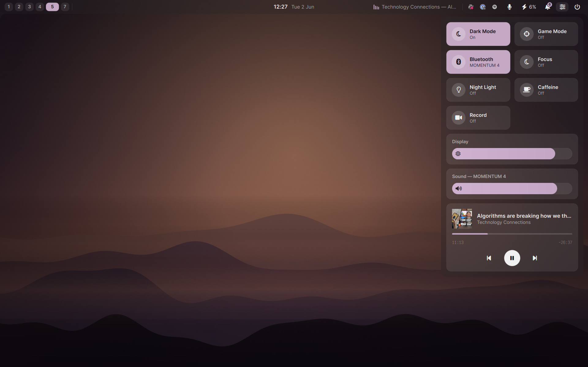

# hare

A neutral **liquid-glass** desktop shell built on [Quickshell](https://quickshell.org).
Translucent grayscale panels with compositor blur that read neutrally over any wallpaper.



The control-center button opens a **Control Center** popup (its own blurred layer surface):
quick toggles, brightness + volume sliders, and an MPRIS now-playing card.

The volume slider is wired to PipeWire, brightness to `brightnessctl`. Toggles whose tool is
missing degrade to a no-op rather than erroring. Optional runtime tools: `networkmanager`,
`hyprsunset`, `wf-recorder`, `brightnessctl`, plus `systemd` for Caffeine.

### Notifications

hare runs a freedesktop **notification server**.

> **Only one process may own `org.freedesktop.Notifications`.** If you run **mako**, **dunst**,
> or another daemon, stop it (`systemctl --user stop mako`) or hare's server won't register.

> Status: early. The bar, control center, notifications, and the volume OSD work;
> launcher / session and other OSDs are not part of hare yet.

## Install (Nix flake + home-manager)

```nix
# flake.nix
{
  inputs.hare.url = "github:peteyycz/hare";
  # ...
}
```

```nix
# home-manager configuration
{ inputs, ... }:
{
  imports = [ inputs.hare.homeManagerModules.default ];

  programs.hare = {
    enable = true;
    theme.fonts = {
      sans = "Inter";
      mono = "JetBrainsMono Nerd Font";
    };
  };
}
```

`hare` runs as a `graphical-session` systemd user service. It does **not** set your wallpaper,
manage idle/lock, or bind keys — it only renders the bar.

### Compositor setup (Hyprland)

The bar uses the layer-shell namespace `hare`. To get the frosted-glass look, blur that layer:

```
layerrule = blur, hare
layerrule = ignorealpha 0.5, hare
```

The keyboard-layout indicator and tray rely on a running Wayland compositor with
`hyprctl` available (Hyprland). Other wlroots compositors render the bar but won't populate
the keyboard layout.

## Options (`programs.hare`)

| Option | Default | Description |
| --- | --- | --- |
| `enable` | `false` | Enable the shell. |
| `package` | this flake's package | The hare package. |
| `systemd.enable` | `true` | Run as a graphical-session user service. |
| `theme.palette.*` | glass defaults | Per-colour overrides (`bg`, `fg`, `accent`, …). |
| `theme.fonts.{sans,mono}` | system defaults | Font families. |
| `bar.height` | `36` | Bar height in px. |
| `bar.style` | `"notched"` | `floating` (inset, rounded), `full` (edge-to-edge), or `notched` (edge-to-edge with concave bottom corners). |

The default palette is also exported as plain data at `hare.lib.glass` so you can reuse the
exact colours for other surfaces (rofi, lock screen, polkit, …).

## Development

```sh
nix develop          # quickshell + tools
quickshell --path ./shell    # run the shell against the working tree (needs a Wayland session)
nix run .            # run the built package
./shell  # config layout: shell.qml + Theme.qml singleton + per-widget .qml files
```

Runtime config is read from `$XDG_CONFIG_HOME/hare/config.json` (written by the home-manager
module).

## License

MIT
